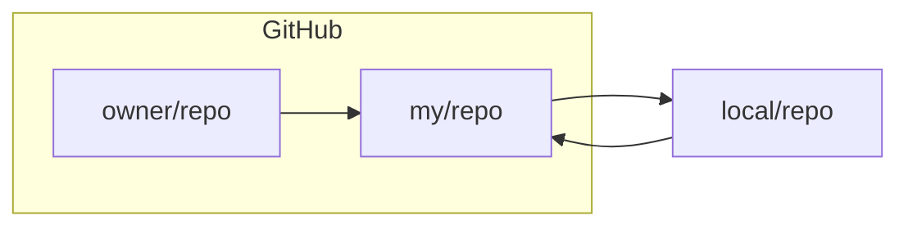

<!---->

# 目录

[toc]

# 项目所有者

## 配置

### 1. 远程仓库

1. **创建SSH Key：**

    ```bash
    ssh-keygen -t rsa -C "youremail@example.com"
    ```
    一路回车即可
    - `id_rsa`是私钥, 不能泄露.
    - `id_rsa.pub`是公钥, 可以告知他人.  


2. **查看`SSH Key`**

    ```bash
    cd ~/.ssh
    cat id_rsa.pub
    ```

    也可在用户主文件夹下`./.ssh`目录查看

3. **配置`SSH Key`**

    在`Github`的用户`Setting`选择`New SSH Key`, 起任意`Title`, 粘贴公钥.

### 2. 本地仓库

1. **初始化仓库**

    ```bash
    git init
    ```

    目录下会生成名为的`.git`文件夹

2. **将本地仓库和GitHub仓库关联**

    ```bash
    git remote add origin <仓库URL>
    ```

    origin为设置的别名

    项目url为: `git@github.com:kyui-azusa/GITTEST.git`
    - 修改`origin`
        ```bash
        git remote set-url origin <新的URL>
        ```
    - 删除`origin`
        ```bash
        git remote remove origin
        ```
## 使用

### 1. 提交版本(本地)

1. **把待提交文件添加到操作区**

    ```bash
    git add <文件名/路径>
	```
	
	可用 `.` 代表所有文件, 多个文件可用空格分割

2. **提交修改**

    ```bash
    git commit -m <message>
    ```

    - `-m` 后的参数为本次提交的说明
    - 一次`commit`可多次`add`不同的文件

### 2. 提交本地代码到 `GitHub`

1. **首次推送**

    ```bash
    git push -u origin master
    ```

    首次推送，需要使用”-u”参数来设置默认的上游分支为`master`

    我们第一次推送`master`分支时，加上了`-u`参数，Git不但会把本地的`master`分支内容推送的远程新的`master`分支，还会把本地的`master`分支和远程的`master`分支关联起来，在以后的推送或者拉取时就可以简化命令
    
2. **简化**

    ```bash
    git push origin master
    ```

## 吐槽

狗屎 一直fatal 研究了好久发现就两个问题

1. url输错了

2. origin输成origin 又不稳定错

    气死我了气死我了气死我了气死我了气死我了气死我了气死我了气死我了气死我了气死我了气死我了气死我了气死我了气死我了气死我了气死我了气死我了气死我了气死我了气死我了

# 项目参与者

## 流程




## 配置

### 1. 连接 `GITHUB`

1. **创建SSH Key：**

    ```bash
    ssh-keygen -t rsa -C "youremail@example.com"
    ```
    
    一路回车即可
    - `id_rsa`是私钥, 不能泄露.
    - `id_rsa.pub`是公钥, 可以告知他人.  

2. **查看`SSH Key`**

    ```bash
    cd ~/.ssh
    cat id_rsa.pub
    ```

    也可在用户主文件夹下`./.ssh`目录查看

3. **配置`SSH Key`**

    在`Github`的用户`Setting`选择`New SSH Key`, 起任意`Title`, 粘贴公钥.

### 2. 复制仓库

> **使用 `Fork`复制仓库**

1. 访问目标仓库 例如我的[测试仓库](https://github.com/kyui-azusa/GITTEST)

2. 依次点击:

    1. <p> <svg height="16" width="16">
            <path d="M5 5.372v.878c0 .414.336.75.75.75h4.5a.75.75 0 0 0 .75-.75v-.878a2.25 2.25 0 1 1 1.5 0v.878a2.25 2.25 0 0 1-2.25 2.25h-1.5v2.128a2.251 2.251 0 1 1-1.5 0V8.5h-1.5A2.25 2.25 0 0 1 3.5 6.25v-.878a2.25 2.25 0 1 1 1.5 0ZM5 3.25a.75.75 0 1 0-1.5 0 .75.75 0 0 0 1.5 0Zm6.75.75a.75.75 0 1 0 0-1.5.75.75 0 0 0 0 1.5Zm-3 8.75a.75.75 0 1 0-1.5 0 .75.75 0 0 0 1.5 0Z"></path>
           </svg>Fork</p>
        
    2. <span data-component="text" style="font-size: 16px; background-color: #1f883d; border-color: #1f232826; color: #ffffff; border-radius: .375rem; display: inline-flex; justify-content: center; align-items: center; height: 2rem; padding: 0 .75rem; border-style: solid; border-width: 1px;">Create fork</span>
    
    即可将仓库复制的你的仓库下 即 `my/repo`

### 3. 本地仓库

1. **克隆 Fork 仓库到本地**

    ```bash
    git clone <仓库URL>
    ```

    注意: 在要创建本地仓库的目录下运行

2. **将本地仓库和GitHub仓库关联(设置上游原始仓库)**

    ```bash
    git remote add origin <仓库URL>
    ```

    origin为设置的别名
    
    项目url为: `git@github.com:kyui-azusa/GITTEST.git`
    
    * **修改`origin`**
        ```bash
        git remote set-url origin <新的URL>
        ```
    * **删除`origin`**
      
        ```bash
        git remote remove origin
        ```

## 使用

### 1. 提交版本(本地)

1. **把待提交文件添加到操作区**

    ```bash
    git add <文件名/路径>
    ```

    可用 `.` 代表所有文件, 多个文件可用空格分割

2. **提交修改**

    ```bash
    git commit -m <message>
    ```

    - `-m` 后的参数为本次提交的说明
    - 一次`commit`可多次`add`不同的文件

### 2. 提交本地代码到 `GitHub`

1. **首次推送**

    ```bash
    git push -u origin master
    ```

    首次推送，需要使用”-u”参数来设置默认的上游分支为`master`

    我们第一次推送`master`分支时，加上了`-u`参数，Git不但会把本地的`master`分支内容推送的远程新的`master`分支，还会把本地的`master`分支和远程的`master`分支关联起来，在以后的推送或者拉取时就可以简化命令

2. **简化**

    ```bash
    git push origin master
    ```

### 3. 提交更改 `Pull Request`

**将个人更改合并到原始仓库**

1. **访问自己同步后的仓库**

2. **提交更改**(在 `GitHub` 上操作)

**依次点击:**

<div style="position: relative; left: 64px; padding:8px"><span style="border-radius: .375rem; border: 1px solid #d1d9e0;">
	      <!-- 前置图标部分 -->
	      <span data-component="leadingVisual" class="prc-Button-Visual-2epfX prc-Button-VisualWrap-Db-eB" style="display: inline-flex; justify-content: center; align-items: center;">
	        <svg aria-hidden="true" focusable="false" class="octicon octicon-git-pull-request" viewBox="0 0 16 16" width="16" height="16" fill="currentColor" style="display: inline-block; user-select: none; vertical-align: text-bottom; overflow: visible;">
<path d="M1.5 3.25a2.25 2.25 0 1 1 3 2.122v5.256a2.251 2.251 0 1 1-1.5 0V5.372A2.25 2.25 0 0 1 1.5 3.25Zm5.677-.177L9.573.677A.25.25 0 0 1 10 .854V2.5h1A2.5 2.5 0 0 1 13.5 5v5.628a2.251 2.251 0 1 1-1.5 0V5a1 1 0 0 0-1-1h-1v1.646a.25.25 0 0 1-.427.177L7.177 3.427a.25.25 0 0 1 0-.354ZM3.75 2.5a.75.75 0 1 0 0 1.5.75.75 0 0 0 0-1.5Zm0 9.5a.75.75 0 1 0 0 1.5.75.75 0 0 0 0-1.5Zm8.25.75a.75.75 0 1 0 1.5 0 .75.75 0 0 0-1.5 0Z"></path>
	        </svg>
	      </span>
	      <!-- 按钮文本 -->
	      <span data-component="text" class="prc-Button-Label-pTQ3x">Contribute</span>
	      <!-- 后置图标部分 -->
	      <span data-component="trailingVisual" class="prc-Button-Visual-2epfX prc-Button-VisualWrap-Db-eB" style="display: inline-flex; justify-content: center; align-items: center;">
          <svg aria-hidden="true" focusable="false" class="octicon octicon-triangle-down" viewBox="0 0 16 16" width="16" height="16" fill="currentColor" style="display: inline-block; user-select: none; vertical-align: text-bottom; overflow: visible;">
              <path d="m4.427 7.427 3.396 3.396a.25.25 0 0 0 .354 0l3.396-3.396A.25.25 0 0 0 11.396 7H4.604a.25.25 0 0 0-.177.427Z"></path>
   </svg>
   </span>
</span>
</div>
<div style="position: relative; left: 64px; padding:8px"><span><span data-component="text" style="font-size: 16px; background-color: #1f883d; border-color: #1f232826; color: #ffffff; border-radius: .375rem; display: inline-flex; justify-content: center; align-items: center; height: 2rem; padding: 0 .75rem; border-style: solid; border-width: 1px;">Open pull request</span></span></div> 
或是

**从菜单栏:**

<div style="position: relative; left: 64px; padding:8px"><svg aria-hidden="true" height="16" viewBox="0 0 16 16" version="1.1" width="16" class="octicon octicon-git-pull-request">  <path d="M1.5 3.25a2.25 2.25 0 1 1 3 2.122v5.256a2.251 2.251 0 1 1-1.5 0V5.372A2.25 2.25 0 0 1 1.5 3.25Zm5.677-.177L9.573.677A.25.25 0 0 1 10 .854V2.5h1A2.5 2.5 0 0 1 13.5 5v5.628a2.251 2.251 0 1 1-1.5 0V5a1 1 0 0 0-1-1h-1v1.646a.25.25 0 0 1-.427.177L7.177 3.427a.25.25 0 0 1 0-.354ZM3.75 2.5a.75.75 0 1 0 0 1.5.75.75 0 0 0 0-1.5Zm0 9.5a.75.75 0 1 0 0 1.5.75.75 0 0 0 0-1.5Zm8.25.75a.75.75 0 1 0 1.5 0 .75.75 0 0 0-1.5 0Z"></path></svg><span>Pull requests</span><span class="counter" title="0" hidden="hidden">0</span></div>
<div style="position: relative; left: 64px; padding:8px"><span data-component="text" style="font-size: 16px; background-color: #1f883d; border-color: #1f232826; color: #ffffff; border-radius: .375rem; display: inline-flex; justify-content: center; align-items: center; height: 2rem; padding: 0 .75rem; border-style: solid; border-width: 1px;">New pull request</span></div>
   最后 <span data-component="text" style="font-size: 16px; background-color: #1f883d; border-color: #1f232826; color: #ffffff; border-radius: .375rem; display: inline-flex; justify-content: center; align-items: center; height: 2rem; padding: 0 .75rem; border-style: solid; border-width: 1px;">Create pull request</span> 即可

## 同步原仓库更新到本地

### 1. 配置上游仓库（原始仓库）

1. **进入本地仓库目录**

2. **添加上游仓库**

    ```bash
    git remote add upstream <上游仓库地址>
    ```

    `<上游仓库地址>`是原始仓库的地址

### 2. 同步上游仓库的更新

1. **获取上游仓库更新**

    ```bash
    git fetch upstream
    ```

    从上游仓库获取最新的更新

    这些更新会被下载到你的本地仓库中，但不会自动合并到你的工作分支

2. **合并上游仓库的更新**：

    - 切换到你想要更新的分支（通常是main或master)

        ```bash
        git checkout <分支名>
        ```

    - 合并分支

        ```bash
        git merge upstream/<分支名>
        ```

        `<分支名>`是要同步的上游仓库的分支名

        如果在合并过程中遇到冲突, 需要手动解决这些冲突, 然后提交合并结果

### *3. 同步更新到 `GitHub`

- 同**`` 提交本地代码到 GitHub ``**的操作

# git分支

### 1. 查看当前分支

```bash
git branch
```

### 2. 列出所有远程分支

```bash
git branch -r
```

同时列出本地和远程的分支：

```bash
git branch -a
```

### 3. 切换到已有分支

```bash
git checkout <分支名>
```

### 4. 创建并切换到新分支

```bash
git checkout -b <新分支名>
```

